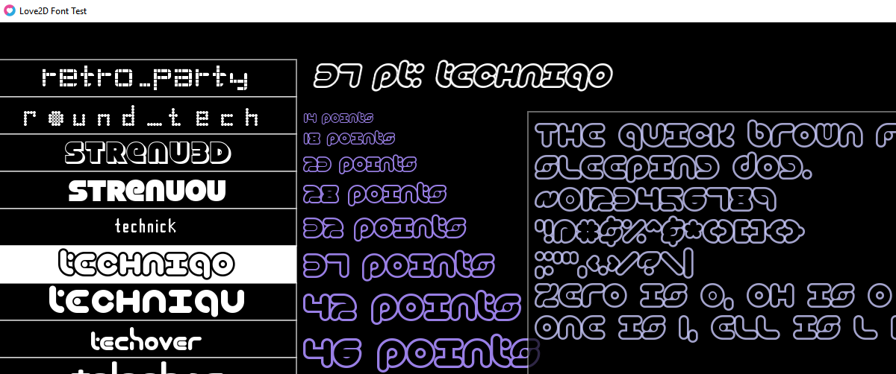

# love2d-font-test

Just a demo I created for [LOVE2D](https://love2d.org/) trying to find some
cool fonts to use.  There's about 174 fonts from [all-free-download.com](https://all-free-download.com/font/).
I tried to pick the cool ones I saw that were '100% free' on the first 50ish pages.

You use up/down/pgup/pgdown to move through the list and it gives more samples on the right:

You can also use `~` for a console modified from [hamsterready's repo](https://github.com/hamsterready/love-console),
not much to do with it, just thought it was cool.

Also included a couple sounds.  I can't remember if i used [bfxr](https://www.bfxr.net/) or
leshy's [SFMaker] to create them.
